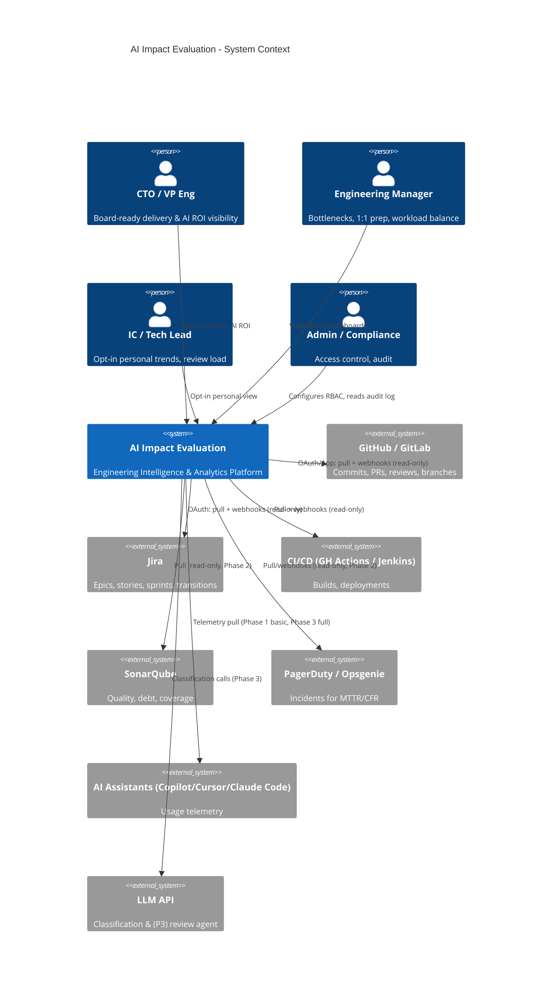
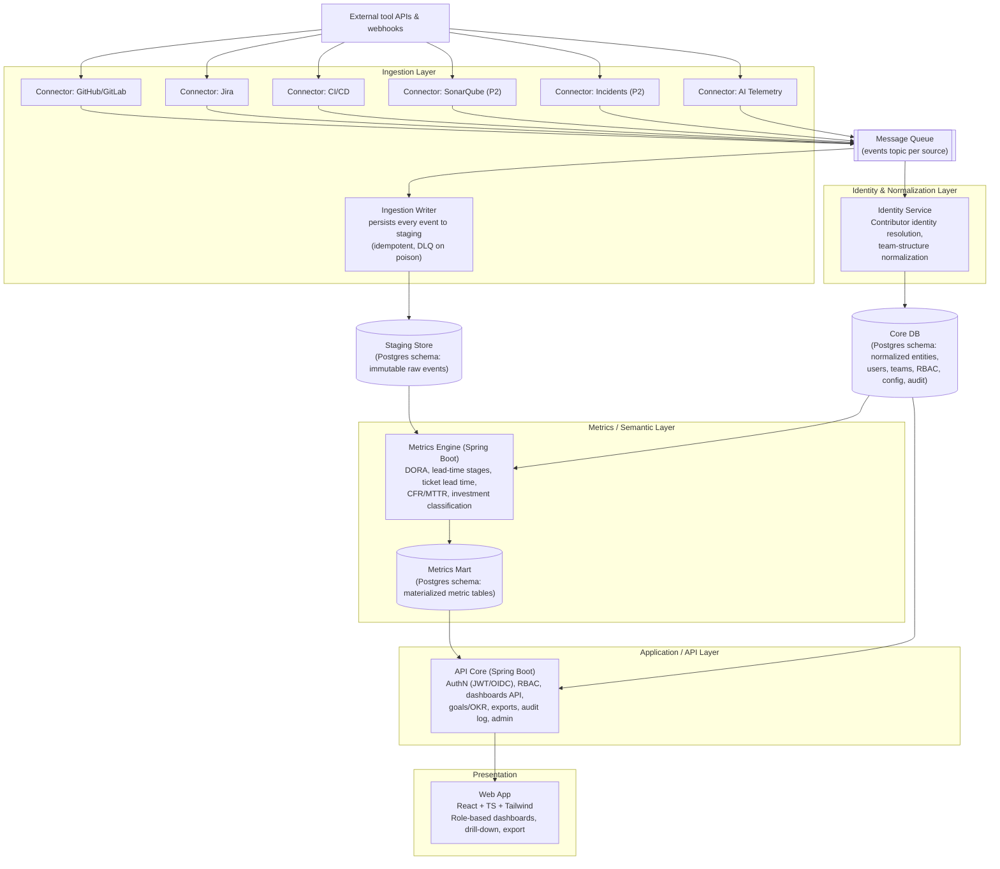

# AI Impact Evaluation — System Architecture

**Status:** Baseline v1.0 (Phase 0 design, derived from BRD §11) · **Owner:** Technical Architect
**Rule:** this document must reflect the running system. Any PR that changes topology, data
flow, a datastore, or an external integration updates this document in the same PR.

## 1. Architecture overview

AI Impact Evaluation is a five-layer, event-driven analytics platform (BRD §11.1):

```
Sources → [Ingestion] → [Identity & Normalization] → [Metrics/Semantic] → [Application/API] → [Presentation]
```

Design drivers (from BRD NFRs):
- **Resilience:** vendor APIs fail routinely → connectors isolated behind a message queue;
  ingestion degrades gracefully, never loses events (FR-1.8, 99.5% uptime target).
- **Freshness:** metrics visible within 15 minutes of a source event.
- **Extensibility:** a new connector is a new service + queue topic — zero core changes.
- **Scale:** horizontal ingestion workers; 10,000+ contributors; ~1M events per dashboard
  query at < 3 s.
- **Privacy:** metadata only — no source code bodies, no message contents (see security standards).

## 2. C4 Level 1 — System Context



## 3. C4 Level 2 — Containers



**Deployment note (MVP):** one PostgreSQL instance with three schemas (`staging`, `core`,
`mart`) — see ADR-0002. The schema separation preserves a clean migration path to a dedicated
analytical store (ClickHouse or warehouse) when event volume demands it, without re-architecture.

## 4. Container responsibilities

| Container | Responsibilities | Phase |
|---|---|---|
| **Web App** (React/TS) | Cockpit, team dashboards, Investment Profile, RAG indicators, drill-down (permission-gated), export; opt-in personal view | 1+ |
| **API Core** (Spring Boot) | OIDC/JWT auth, RBAC + data-visibility filters, dashboard/report APIs, goals/OKR, admin console APIs, audit logging, export generation | 1+ |
| **Metrics Engine** | Consumes normalized events; computes DORA (deployment frequency, lead time, CFR, MTTR), lead-time stage breakdown, ticket lead time, PR analytics; materializes metric tables; incremental recompute ≤ 15 min | 1+ |
| **Identity Service** | Reconciles contributor identities across tools (email/name/user-ID heuristics + manual override UI via API Core); org > team > sub-team structure import (FR-1.4, FR-1.5) | 1+ |
| **Connectors** (one service per tool) | OAuth/App auth to vendor; webhook receipt (signature-verified) + backfill polling; rate-limit-aware; publish raw events to queue; own no business logic | 1+ |
| **Message Queue** | Buffering, retry, DLQ; isolates vendor failures from core (FR-1.8); topology in ADR-0003 | 1+ |
| **Ingestion Writer** | Sole writer to staging: consumes all `aiimpacteval.events` traffic, idempotent insert on `(source, sourceId, eventType)`, poison messages to DLQ | 1+ |
| **Staging Store** | Immutable, append-only raw events with source metadata for replay/audit | 1+ |
| **Core DB** | Normalized entities (repos, PRs, tickets, deployments, incidents), identities, teams, RBAC, config, goals, audit log | 1+ |
| **Metrics Mart** | Pre-aggregated metric tables the dashboards query (< 3 s at 1M events) | 1+ |
| **AI Modules** (Phase 3) | LLM classification (AI-usage detection, ticket/PR text), AI ROI computation, AI code-review agent (separate service; posts PR comments) | 3 |

## 5. Key data flows

### 5.1 Ingestion (webhook path)
1. Vendor fires webhook → connector verifies signature → wraps payload in an envelope
   `{source, sourceId, eventType, receivedAt, connectorVersion, payload}` → publishes to queue.
2. Staging consumer appends to immutable staging table (idempotent on `source+sourceId+eventType`).
3. Identity service consumes, resolves contributor/team references, upserts normalized
   entities into Core DB.
4. Metrics engine incrementally recomputes affected metric windows → updates mart.
   End-to-end target: ≤ 15 minutes (alert if lag exceeds).

### 5.2 Ingestion (backfill/poll path)
Connectors also poll for historical backfill on first connect (target: first insight < 30 min)
and to heal webhook gaps. Same envelope, same idempotent path — replay-safe by design.

### 5.3 Dashboard query
FE → API Core (JWT verified, RBAC + visibility filters applied server-side) → mart queries
(pre-aggregated; org→team→IC drill-down levels permission-checked per request).
**Implemented (E4-S2):** the mart's scope column (`mart.metric_daily.scope_id` +
`scope_type`) holds a repo full name, `*` for org, or a team UUID; `GET /api/v1/teams` lists
teams for the picker and `GET /api/v1/metrics/cockpit?scope=<id>` serves any of the three.
Per-user team/individual visibility restriction (beyond role) is not yet enforced — any
analytical-role caller can pass any scope value; tracked in PRD Appendix B alongside E8-S2's
opt-in gate for individual-level views.

### 5.4 Failure mode
Vendor 429/5xx → connector backs off (honors `Retry-After`), events queue up; queue consumer
failures retry with backoff → DLQ + alert. Nothing downstream of the queue notices a vendor
outage; dashboards serve last-computed metrics with a freshness indicator.

## 6. Metric computation principles

- **No manual tagging** — deployments detected from CI/CD events; failures from incident
  linkage, hotfix/rollback heuristics (FR-8.2.4); planned/unplanned/rework classification from
  Jira↔Git linkage heuristics (branch names, PR titles, smart commits), later LLM-assisted.
- Every metric is **reproducible from staging** — recompute must yield identical results
  (append-only raw data + versioned metric logic).
- Metric logic versions are recorded with computed values, so historical numbers are explainable.
- All metric definitions published in `docs/01-product/metric-definitions.md` and in-app.
- **Team rollups are computed from raw per-event rows joined to `core.team_repo`, never by
  averaging repo-day medians** — for percentile metrics (lead time, MTTR, PR cycle time),
  averaging medians across repos does not yield the team's true median.

## 7. Security architecture (summary — full doc in 02-standards)

- OIDC/SSO → short-lived JWT; RBAC roles (`ADMIN`, `ENG_LEADER`, `MANAGER`, `IC`,
  `FINANCE_READONLY`) enforced in API Core on every request; data-visibility filters applied
  at query time. **Implemented** (ADR-0004): api-core is an RS256 JWT resource server; the
  filter chain gates `/api/v1/metrics/**` to analytical roles and `/api/v1/audit/**` and
  `/api/v1/admin/**` to ADMIN. A gated, audited dev-token bridge stands in until OIDC lands.
- Connector credentials encrypted at rest, least-privilege read-only scopes.
- Audit log (append-only, ≥ 12 months) for config, access, and export events.
- TLS everywhere; AES-256 at rest; webhook signature verification; tenant-ID scoping reserved
  in the schema from day one for Phase 4 multi-tenancy.

## 8. Technology stack (ADR-0001)

| Layer | Choice | Rationale |
|---|---|---|
| Frontend | React 18 + TypeScript + Tailwind + Recharts | BRD §11.2; internal expertise |
| Backend | Java 21 + Spring Boot 3 (Web, Data JPA, Security) | BRD §11.2; internal patterns |
| Databases | PostgreSQL 16 (staging/core/mart schemas) | Single store for MVP; ADR-0002 |
| Queue | RabbitMQ (MVP) | Retry/DLQ semantics out of the box; ADR-0002; Kafka revisit at scale |
| Auth | OIDC + JWT (RS256), Spring Security | BRD §11.2 |
| Migrations | Flyway | Forward-only, expand/contract |
| Local dev / deploy | Docker Compose → containerized cloud (K8s when scale demands) | Start simple |
| Observability | Structured JSON logs, OpenTelemetry, Prometheus + Grafana | NFR availability/freshness alerting |
| LLM (Phase 3) | Anthropic Claude API via agent framework | ADR required before adoption |

## 9. Phase mapping

| Phase | Architecture scope |
|---|---|
| 1 (MVP) | FE + API Core + Metrics Engine + Identity + 3 connectors (Git, Jira, CI/CD) + queue + Postgres. DORA + Cockpit + RBAC + audit log. |
| 2 | SonarQube & incident connectors; Investment Profile + PR analytics + Goals in Metrics Engine/API; SOC 2 groundwork. |
| 3 | AI telemetry depth, LLM classification service, AI ROI module, AI review agent service, custom-report builder; VPC/on-prem ingest agent (connectors already isolated → package them as the agent). |
| 4 | Multi-tenant hardening (RLS), SaaS packaging, SOC 2 Type II, consider ClickHouse for mart. |

## 10. Architecture decision log

See [decisions/](decisions/). Current: ADR-0001 (technology stack), ADR-0002 (queue-isolated
connectors, single Postgres for MVP), ADR-0003 (event envelope contract and queue topology),
ADR-0004 (authentication, RBAC, and audit enforcement in api-core).
